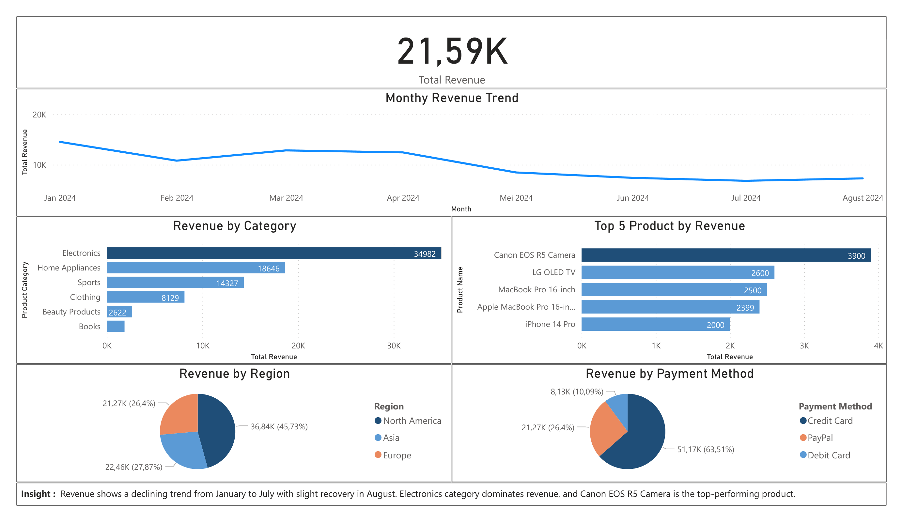

# 📊 E-Commerce Sales Analysis Dashboard

## 📌 Overview
This project analyzes e-commerce transactional sales data to uncover trends, identify top-performing products, and generate actionable business insights. The analysis is conducted using Python and Excel, while the visualization is built using Power BI.

---

## 🎯 Objectives
- Analyze monthly revenue trends
- Identify top-performing products
- Evaluate revenue contribution by product category
- Understand regional sales distribution
- Analyze customer payment preferences

---

## 🛠️ Tools & Technologies
- Python (Pandas)
- Microsoft Excel
- Power BI

---

## 📂 Dataset
The dataset is simulated and used for portfolio and learning purposes.
The dataset contains transactional sales data, including:
- Product Name
- Product Category
- Sales Revenue
- Region
- Payment Method
- Date (Monthly)

---

## 🔄 Project Workflow
1. Data Cleaning & Preprocessing (Python & Excel)
2. Exploratory Data Analysis (EDA)
3. Data Aggregation & Transformation
4. Dashboard Development (Power BI)
5. Insight Generation

---

## 📊 Dashboard Features
The Power BI dashboard includes:
- Total Revenue KPI
- Monthly Revenue Trend
- Top 5 Products by Revenue
- Revenue by Product Category
- Revenue by Region
- Revenue by Payment Method

---

## 🔍 Key Insights
- Revenue shows a declining trend from January to July, with slight recovery in August
- Electronics is the highest revenue-generating category
- Canon EOS R5 Camera is the top-performing product
- Credit Card is the most frequently used payment method
- North America contributes the highest share of total revenue

---

## 🖼️ Dashboard Preview

---

## 📁 Project Structure
ecommerce-sales-analysis/
│
├── data/
│ ├── raw_data.csv
│ ├── clean_data.xlsx
│
├── notebook/
│ ├── analysis.ipynb
│
├── output/
│ ├── summary.xlsx
│
├── dashboard/
│ ├── Sales_Analysis_PowerBI.pbix
│
└── README.md

---

## 🚀 Conclusion
This project demonstrates the ability to transform raw data into meaningful insights through data cleaning, analysis, and visualization. The insights generated can support strategic business decisions in sales and product management.

---

## 📬 Contact
- Email: haramainr@gmail.com
- LinkedIn: https://linkedin.com/in/haramainr
- GitHub: https://github.com/haramainr
